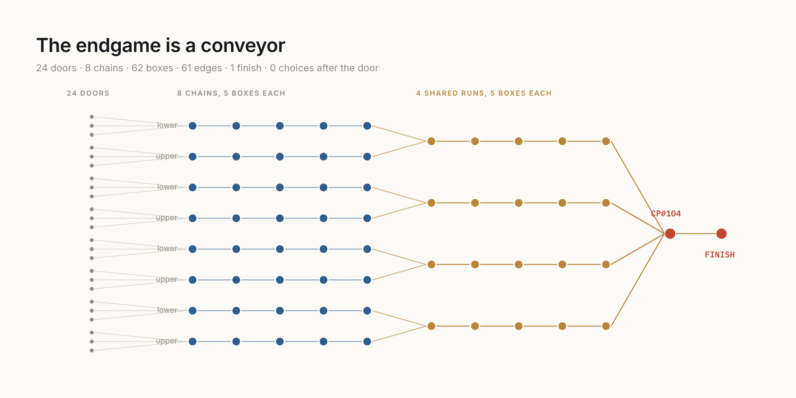

# haystack6-322

**[Haystack 6](https://trackmania.exchange/maps/323677)** by **FruitSesh** is a
Trackmania 2020 map with 6,396 checkpoints collapsing into **322 link groups**.
Its leaderboard has no finisher. One person has ever completed it — the author,
validating the build before release — and the timestamps of that run are
embedded in the released map, which is proof that a complete route exists on
exactly this build.

This repo is the map as a graph, the best route anyone has produced, and
everything learned while failing to improve it.



## The open question

> **Claim all 322 link groups in one run, then cross the Finish.**

- Best known: **321 of 322**, and three different routes achieve it, each
  omitting a **different** group. So no single group is the obstruction.
- The union of every route anyone has found is **INFEASIBLE**. A 322 needs an
  edge nobody has used.
- A walk claiming all 322 groups *does* exist — it is illegal by exactly one
  duplicated group, and across 104 excision sites not one has the edge that
  would make the deletion legal.
- Whether a 322 exists **in this graph** is open. There is no proof in either
  direction.
- unbeaten.at carries a standing **$200 bounty**, sponsored by Wizord.tv, for
  beating the 15:11.615 author time. It was still active on 2026-08-31.

## Three ways in

| you want to | read |
|---|---|
| drive the map, and know how it works | **[THE-MAP.md](THE-MAP.md)** |
| solve it as a routing instance | **[THE-PROBLEM.md](THE-PROBLEM.md)** |
| know what was already tried, and what died | **[THE-CAMPAIGN.md](THE-CAMPAIGN.md)** |

[FACTS.md](FACTS.md) is the register those three cite. Each numbered row is a
finding that was measured or observed rather than argued; the documents cite a
row instead of restating it.

## What is here

```
data/graph.json            6,396 nodes · 34,007 edges · 323 group ids, 322 claimable
data/facing.json           the authored spawn facing of every checkpoint
data/spire.json            the endgame conveyor as its own graph
data/author-waypoints.json the author's 323 split times, from the released map
routes/                    six refereed routes, 315 to 321 groups
viz/                       figures, and the script that proves they match the data
archive/                   the 132-route known pool that "novel" is measured against
solve/                     the CP-SAT model that reaches 321, and the novelty ranker
verify/                    the referee, and how to submit a claim
```

Each directory has its own README.

## Claiming a 322

```bash
./verify/check.sh                                    # re-validate everything here
bun verify/validate.ts my-route.json                 # or:
node --experimental-strip-types verify/validate.ts my-route.json
```

Exit **0** complete · **1** legal but partial · **2** illegal. **A 322 claim is
a route file plus exit code 0. Nothing else is a claim.**

No dependencies, no build step. The referee needs only Bun or Node 22.6+.

## Reproducing the 321

```bash
pip install ortools
python3 solve/solve_cpsat_map.py --hint routes/best-321-partial.json --max \
    --time 120 --workers 4 --all-different-circuit --probing-level 0 --out mine.json
bun verify/validate.ts mine.json
```

Reaches FEASIBLE at 321/322 in 120 s on four workers. Those two solver flags are
the difference between the configuration that found the 321 and OR-Tools'
defaults, which did not. [solve/README.md](solve/README.md) has the rest.

## Credit and licence

The map is **Haystack 6 by FruitSesh**, TMX 323677. It is not redistributed
here; the graph is data derived from it.

`verify/` is MIT ([LICENSE](LICENSE)). The data, the routes and these documents
are CC-BY-4.0 ([LICENSE-DATA](LICENSE-DATA)).
